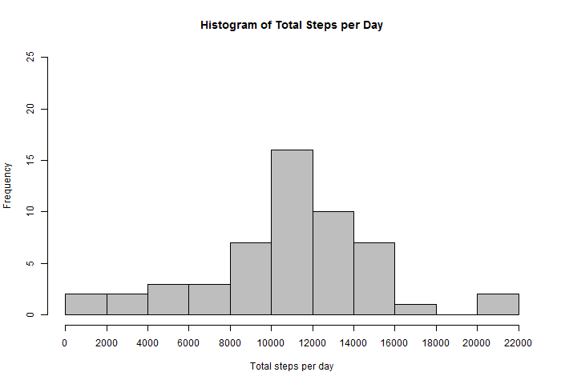
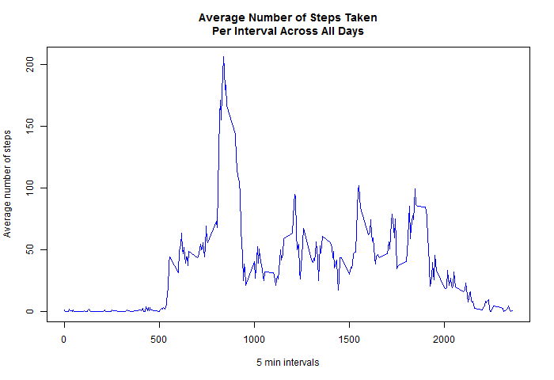
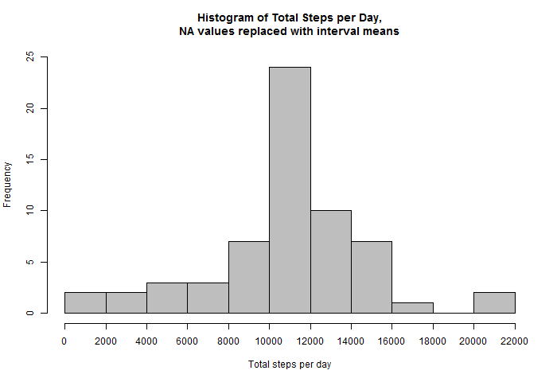
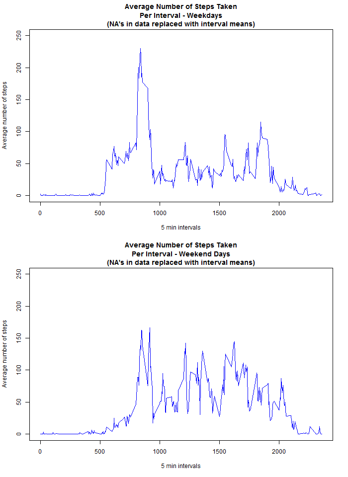

## Loading and preprocessing the data

The data for this assignment was downloaded from the course web site:

* **Dataset:** [Activity monitoring data [52K]](https://d396qusza40orc.cloudfront.net/repdata%2Fdata%2Factivity.zip)

The variables included in this dataset are:

* **steps:** Number of steps taking in a 5-minute interval (missing values are coded as NA)

* **date:** The date on which the measurement was taken in YYYY-MM-DD format

* **interval:** Identifier for the 5-minute interval in which measurement was taken

The dataset is stored in a comma-separated-value (CSV) file and there are a total of 17,568 observations in this dataset.


The data has to be placed in R's working directory. Code for uploading data into R:
```{r loading_data,echo=TRUE}
aData<-read.csv("activity.csv")
```


## What is mean total number of steps taken per day?

**Note** - for this part of the assignment the missing values in the dataset are ignored.  
The total number of steps taken per day calculated using aggregate() function, the results are presented in the histogram.
```{r total_steps_per_day,echo=TRUE,results='hide'}
stepsPerDay<-aggregate(steps~date,data=aData,sum)
png(file="figure/hist1.png",width = 700, height = 480,bg = "white")
      aHist<-hist(stepsPerDay$steps,breaks=10,col=8,main="Histogram of Total Steps per Day",
            xaxt="n", xlab="Total steps per day",ylim=c(0, 25))
      axis(1, at = aHist$breaks) 
dev.off()
```



```{r total_steps_per_day_mean_median,echo=TRUE,results='markup'}
aMean<-as.integer(round(mean(stepsPerDay$steps),0))
aMedian<-as.integer(round(median(stepsPerDay$steps),0))
print(paste("Mean of total steps per day =",aMean,"; Median of total steps per day =",aMedian))
```
  
**Total number of steps taken per day:**

* **mean** = `r aMean`  
* **median** = `r aMedian`  

## What is the average daily activity pattern?

Average daily activity pattern is calculated as average number of steps per given 5 minute interval, averaged across all days. Results are presented in the plot.  
**Note** - 5 minute intervals map to hh:mm, e.g. 5->00:05, 1850->18:50, etc.  
```{r avg_daily_activity_pattern,echo=TRUE,results='hide'}
avgStepsPerInterval<-aggregate(steps~interval,data=aData,mean)
png(file="figure/fig1.png",width = 700, height = 480,bg = "white")
      plot(avgStepsPerInterval$interval,avgStepsPerInterval$steps,type="l",col="blue",main="Average Number of Steps Taken\nPer Interval Across All Days",xlab="5 min intervals",ylab="Average number of steps")
dev.off()
```



```{r avg_daily_activity_pattern_maxSteps, echo=TRUE,results='markup'}
maxSteps<-max(avgStepsPerInterval$steps)
maxStepsInterval<-avgStepsPerInterval$interval[match(maxSteps,avgStepsPerInterval$steps)]
print(paste("Maximum of average steps per interval =",round(maxSteps,0),"; The interval with maximum of average steps per interval = ",maxStepsInterval))
```

The 5-minute interval that contains the maximum number of steps, averaged across all the days in the dataset, is `r maxStepsInterval` - with `r as.integer(round(maxSteps,0))` steps.


## Imputing missing values

There is a number of days/intervals in the data used so far where there are missing values (coded as NA). The presence of missing days may introduce bias into some calculations or summaries of the data. Therefore the missing values are filled with previously calculated means for the corresponding 5-minute intervals and the new data set constructed. Then new histogram of total number of steps taken per day is plotted and mean and median of the updated data set reported.
```{r imputing_missing_values,echo=TRUE,results='markup'}
newData<-aData
naRows<-is.na(newData$steps)
print(paste("Number of missing (NA) values in the data set is", sum(naRows)))
```
```{r imputing_missing_values_hist,echo=TRUE,results='hide'}
newData$steps[naRows]<-avgStepsPerInterval$steps[match(newData$interval[naRows],avgStepsPerInterval$interval)]
stepsPerDay2<-aggregate(steps~date,data=newData,sum)
png(file="figure/hist2.png",width = 700, height = 480,bg = "white")
      aHist2<-hist(stepsPerDay2$steps,breaks=10,col=8,main="Histogram of Total Steps per Day,\nNA values replaced with interval means",xaxt="n", xlab="Total steps per day",ylim=c(0, 25))
      axis(1, at = aHist2$breaks)
dev.off()
```



```{r imputing_missing_values_mean_median,echo=TRUE,results='markup'}
aMean2<-as.integer(round(mean(stepsPerDay2$steps),0))
aMedian2<-as.integer(round(median(stepsPerDay2$steps),0))
print(paste("Mean of total steps per day =",aMean2,"; Median of total steps per day =",aMedian2))
```
As the new histogram shows, replacing NA values in the data set with the interval means resulted in significant increase in frequency of 10,000-12,000 steps per day, while the frequencies for other bins remained more or less the same.  
The mean and the median of the data stayed almost the same as well.


## Are there differences in activity patterns between weekdays and weekends?

The next step of analysis is exploring the differences in average number of steps taken during the weekdays and weekend days. Data used is the new data set with NA values replaced with interval means.
```{r weekdays_vs_weekend_days, echo=TRUE,results='hide',fig.height=10}
newData$weekday<-weekdays(as.Date(newData$date))
newData$weekday[newData$weekday=="Saturday"|newData$weekday=="Sunday"]<-"weekend"
newData$weekday[newData$weekday!="weekend"]<-"weekday"
newData$weekday<-as.factor(newData$weekday)

avgStepsPerWeekdayInterval<-aggregate(steps~interval,data=newData[newData$weekday=="weekday",],mean)
avgStepsPerWeekendDayInterval<-aggregate(steps~interval,data=newData[newData$weekday=="weekend",],mean)

png(file="figure/fig2.png",width = 700, height = 960,bg = "white")
      par(mfrow=c(2,1))
      plot(avgStepsPerWeekdayInterval$interval,avgStepsPerWeekdayInterval$steps,type="l",col="blue",main="Average Number of Steps Taken\nPer Interval - Weekdays\n(NA's in data replaced with interval means)",xlab="5 min intervals",ylab="Average number of steps",ylim=c(0,250))
      plot(avgStepsPerWeekendDayInterval$interval,avgStepsPerWeekendDayInterval$steps,type="l",col="blue",main="Average Number of Steps Taken\nPer Interval - Weekend Days\n(NA's in data replaced with interval means)",xlab="5 min intervals",ylab="Average number of steps",ylim=c(0,250))
dev.off()
```


As it can be seen from the charts, there is a slight difference in weekday and weekend day patterns - the morning peak of total steps starts later, is wider during the weekend days and less concentrated and there is more interval-to-interval variation in number of steps taken.  
  
    
    